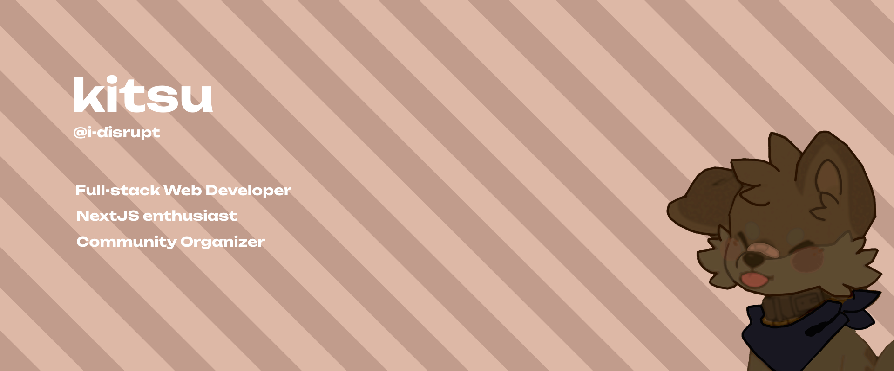

## Hi! I'm kitsu 👋🏼
<!-- Image banner here -->

---
### `About Me`:

I'm a highly enthusiastic full-stack developer who is passionate about my work, creating technology to elevate people, and building communities. I have a wise range of experience with various technologies including `ReactJS`, `JavaScript`, `APIs`, `Markup`, and `NextJS`. I am constantly learning and expanding my skill-set to stay up to date with the latest technologies. I love to work on new and challenging projects, and am dedicated to delivering high-quality solutions for people across the globe. -- My interest in the `NextJS` ecosystem led me to launch <!-- Link My Portfolio --> [my personal website](https://nodisrupt.net/), a place for you to view my socials, commission, and learn more about me!

---
### `Recently worked with`:

<table>
   <thead>
      <tr>
         <th>Languages</th>
         <th>Libraries</th>
         <th>Tools</th>
      </tr>
   </thead>
   <tbody>
      <tr>
         <td>JavaScript</td>
         <td>ExpressJS</td>
         <td>Stripe</td>
      </tr>
      <tr>
         <td>TypeScript</td>
         <td>NextJS, ReactJS</td>
         <td>Codux</td>
      </tr>
      <tr>
         <td>PHP</td>
         <td>Pocketmine</td>
         <td></td>
      </tr>
      <tr>
         <td>Java</td>
         <td>Discord4J</td>
         <td></td>
      </tr>
      <tr>
         <td>Python</td>
         <td>Django</td>
         <td></td>
      </tr>
   </tbody>
</table>

---
### `Find me on Discord`:

> You can find me on my [discord](https://discord.gg/WNANVdswey) server. :)

---
